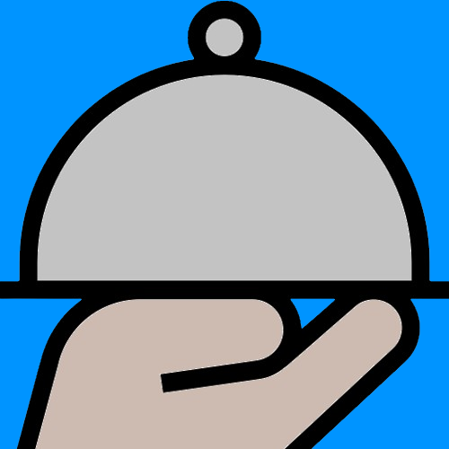

# Mate & Fuego

## Integrantes

- **Gerardo Toranzo**
- **Juan Manuel Portela**
- **Quimey Rojo**

## Primer Sprint

### FECHA INICIO: 26-10-2024 / FECHA FINAL: 9-11-2024

- - ✔ **Alta empleados** - Quimey Rojo
- - ✔ **Alta dueño / supervisor** - Quimey Rojo
- - ✔ **Alta clientes** - Juan Manuel Portela
- - ✔ **Alta de Mesa** - Juan Manuel Portela
- - ✔ **Alta de productos** - Gerardo Toranzo
- - ✔ **Login** - Gerardo Toranzo
- - ✔ **Icono y splash** - Gerardo Toranzo
- - ✔ **QR de ingreso al local** - Gerardo Toranzo
- - ✔ **QR de la mesa** - Juan Manuel Portela
- - ✔ **QR de propina** - Quimey Rojo

## Segundo Sprint

#### FECHA INICIO: 21/10/2021 - FECHA FIN: 30/10/2021

- ✔ **Asignación de mesa** - Juan Manuel Portela
- ✔ **Ingreso del local** - Juan Manuel Portela
- ✔ **Solicitar pedido** - Rojo Quimey
- ✔ **Carrito de productos solicitados** - Rojo Quimey
- ✔ **Sector bartender** - Juan Manuel Portela
- ✔ **Mostrar tiempo estimado del pedido** - Rojo Quimey
- ✔ **Preparar pedido y entregar pedido al mozo** - Rojo Quimey
- ✔ **QR ingreso al local** - Gerardo Toranzo
- ✔ **QR lista de espera** - Juan Manuel Portela
- ✔ **QR de la mesa** - Juan Manuel Portela / Gerardo Toranzo / Rojo Quimey
- ✔ **Dueño/supervisor habilita entrada de clientes** - Juan Manuel Portela
- ✔ **Metre habilita entrada de la lista de espera** - Juan Manuel Portela

## 🖥 Tercera semana

#### FECHA INICIO: 30/10/2021 - FECHA FIN: 6/11/2021

- ✔ **Envio de correo electrónico** - Gerardo Toranzo
- ✔ **3 Push Notifications** - Gerardo Toranzo / Rojo Quimey / Juan Manuel Portela
- ✔ **Chat** - Rojo Quimey
- ✔ **Listado pedidos del mozo** - Juan Manuel Portela
- ✔ **Listado pedidos del cocinero** - Gerardo Toranzo
- ✔ **Cuenta del pedido** - Rojo Quimey
- ✔ **Sección post pedido** - Rojo Quimey
- ✔ **Sección estado del pedido** - Gerardo Toranzo
- ✔ **Estilos** - Gerardo Toranzo / Juan Manuel Portela / Rojo Quimey
- ✔ **Sonido entre paginas** - Gerardo Toranzo
- ✔ **Vibraciones en errores** - Gerardo Toranzo

## 🖥 Cuarta semana

#### FECHA INICIO: 6/11/2021 - FECHA FIN: 13/11/2021

- ✔ **Arreglo palabras en ingles** - Gerardo Toranzo
- ✔ **Arreglo espacios neutros en estado del pedido y importe más grande en cuenta del pedido** - Juan Manuel Portela
- ✔ **Productos más grandes en listado de pedidos y mejora de visibilidad en el carrito** - Rojo Quimey

## 🖥 Quinta semana

#### FECHA INICIO: 13/11/2021 - FECHA FIN: 20/11/2021

- ✔ **Reserva de mesa en tiempo futuro** - Juan Manuel Portela
- ✔ **Push Notification reserva de la mesa** - Gerardo Toranzo
- ✔ **Juego de 10% descuento** - Rojo Quimey

## QRS

### QR Ingreso AL local

### QR Propinas

#### QR 0% Propina Malo

#### QR 5% Propina Regular

#### QR 10% Propina Buena

#### QR 15% Propina Muy Buena

#### QR 20% Propina Excelente

# Tour de la aplicación

## Interfaz del cliente

### Ingreso del cliente

Al ingresar a la aplicación el cliente tiene la opcion de iniciar sesión si ya posee una cuenta, o de registrarse como cliente normal, o en su defecto, como cliente anonimo.

### Una vez dentro...

El cliente debe escanear un QR que lo ingresa a la lista de espera. De ser aceptado y de habérsele asignado una mesa, debe escanear el QR de la misma (no puede escanear otro).

### Realización de pedido

Una vez aquí, el cliente tiene la opción de consultar al mozo mediante un chat, o realizar el pedido correspondiente.

### Luego de realizar el pedido...

Aqui el cliente tiene la opción de confirmar la recepción de su pedido, además puede volver a escanear el código QR de la mesa para visualizar el estado del pedido, y una vez recibido puede pedir la cuenta o acceder a la encuesta.

### Cuenta del pedido

El cliente pide la cuenta y en la misma, se encuentra la opción de escanear un codigo QR para la propina, jugar un juego para obtener un descuento en el primer intento. Una vez realizado el pago, debe esperar la confirmación del mozo.

### Visualización de los graficos de la encuesta

Al retirarse del local el cliente puede escanear nuevamente el QR de ingreso al local para visualizar los graficos de las encuestas.

## Interfaz de los empleados

### Dueño/supervisor y Metre

Aquí se encuentran las tareas que puede realizar cada uno, cuando alguien ingresa al local y cuando alguien ingresa a la lista de espera respectivamente.

### Bartender, Chef y Mozo

En esta sección tanto el bartender como el chef realizan los pedidos y se los devuelven al mozo. Los pedidos se separan por producto, asi que el tiempo de realización es el del producto que mayor elaboración conlleve. El mozo se encarga de enviar los pedidos a las secciones anteriormente mencionadas, entregarlo al cliente y por último confirmar el pago.

## Push notification y correo electronico

Aquí se pueden ver los correos electronicos que le llegarian la cliente al momento de ingresar a la aplicación y cuando es habilitado. También se encuentra una de las distintas push notification que se mandan a lo largo de la aplicación

